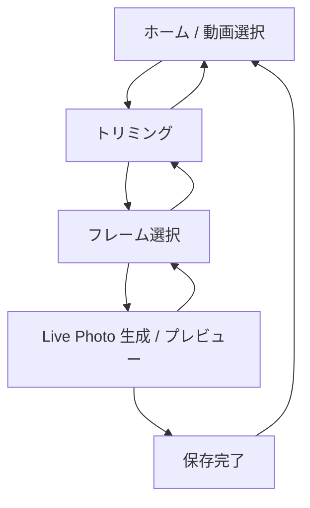
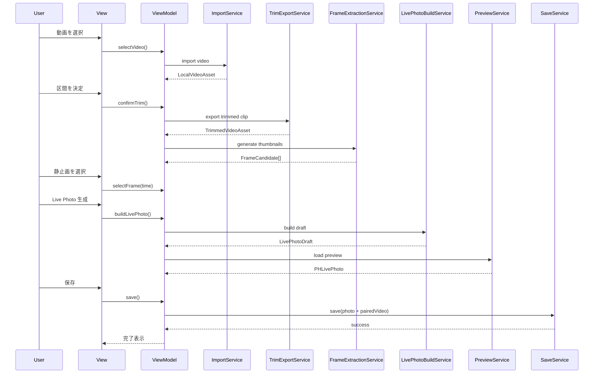

# 動画 → Live Photo 変換アプリ 技術設計書

- 文書名: 動画 → Live Photo 変換アプリ 技術設計書
- 文書種別: 実装設計 / 技術仕様書
- 想定読者: iOS エンジニア、テックリード、レビュー担当、将来の保守担当
- 対象プラットフォーム: iOS
- 想定実装言語: Swift
- 想定UIフレームワーク: SwiftUI
- 想定最低OS: iOS 17 以降推奨
- 文書目的:  
  本アプリの**目的、責務、画面構造、モジュール構造、データフロー、Live Photo 生成方式、保存処理、例外系、性能要件、テスト観点、実装順序**を一読で把握できる状態にすること。

---

## 1. アプリ概要

### 1.1 アプリの目的
本アプリは、iPhone 内の写真ライブラリに保存されている**既存の動画**を素材として、ユーザーが任意の区間を切り出し、その区間内から任意のフレームを静止画として選択し、最終的に **Live Photo として生成・保存**することを目的とする。

### 1.2 ユーザー価値
ユーザーは以下を一つのアプリ内で完結できる。

1. 写真ライブラリから動画を選択する
2. 動画の任意区間をトリミングする
3. 切り出した区間内から代表静止画を選ぶ
4. Live Photo を生成してプレビューする
5. 写真ライブラリへ保存する

### 1.3 本アプリが解決する課題
iPhone 標準機能では、一般的な利用導線として「既存動画 → 任意区間選択 → 静止画選択 → Live Photo 化」を一連の UX として提供していない。  
本アプリはこの一連操作を、**変換ツールとして明確なUIと責務分離された実装**で提供する。

### 1.4 完成条件
本設計における完成条件は次の通り。

- ユーザーが動画を 1 本選択できる
- ユーザーが動画の開始位置・終了位置を決定できる
- アプリが切り抜き区間内のフレーム一覧を生成できる
- ユーザーが 1 フレームを代表静止画として選択できる
- アプリが Live Photo 用リソースを構築できる
- アプリが Live Photo をプレビューできる
- アプリが写真ライブラリに保存できる
- 保存後、写真アプリ上で Live Photo として扱えることを確認できる

---

## 2. スコープ

### 2.1 対象範囲
本設計書が扱うのは以下の範囲である。

- iPhone の写真ライブラリからの動画選択
- 動画トリミングUI
- フレーム抽出UI
- Live Photo リソース生成
- Live Photo プレビュー
- 写真ライブラリ保存
- 保存時の権限処理
- 一時ファイル管理
- 例外処理
- テスト方針
- 実装フェーズ分割

### 2.2 対象外
以下は初期バージョンでは対象外とする。

- Android 対応
- iPad 専用最適化
- macOS 版
- iCloud Drive / Files からの汎用ファイル取込
- 複数動画の一括変換
- 動画の色補正、フィルタ、速度変更
- Live Photo の高度編集
- 共有シート経由の拡張機能
- サーバー連携
- ユーザーアカウント機能
- 変換履歴のクラウド同期

---

## 3. 想定ユースケース

### 3.1 基本ユースケース
1. ユーザーがアプリを起動する
2. 動画選択画面で写真ライブラリから動画を 1 本選ぶ
3. トリミング画面で必要な区間を決める
4. フレーム選択画面で代表静止画を決める
5. 変換画面で Live Photo を生成する
6. プレビューを確認する
7. 写真ライブラリに保存する
8. 保存成功メッセージを受け取る

### 3.2 代表的な利用シーン
- 動画のベストな瞬間を Live Photo として残したい
- ロック画面候補として短い動き付き写真を作りたい
- SNS 用素材や個人保存用に印象的な瞬間を Live Photo 化したい

---

## 4. 要件定義

## 4.1 機能要件

### FR-01 動画選択
- 写真ライブラリから動画を 1 本選択できること
- 対象メディア種別は video のみとする
- 選択後、アプリ内一時領域へ処理可能な形式で取り込めること

### FR-02 動画プレビュー
- 選択した動画をアプリ内で再生できること
- 再生 / 一時停止 / シークができること

### FR-03 トリミング
- ユーザーが開始位置と終了位置を指定できること
- 開始位置 < 終了位置 であることを保証する
- 切り出し可能長の最小値・最大値をアプリ側ポリシーとして制御可能にすること
- 初期値は「動画全体」または「推奨長の中央付近」を採用できる構造にすること

### FR-04 フレーム抽出
- 切り出し区間内から複数サムネイルを生成すること
- ユーザーが候補フレームを横スクロールで選択できること
- 選択フレームの時刻を保持できること

### FR-05 静止画決定
- ユーザーが Live Photo の代表静止画として 1 枚を決定できること
- 再選択可能であること

### FR-06 Live Photo 生成
- 静止画リソースと paired video リソースを構築すること
- 生成中の進行状態を UI に反映できること
- 失敗時に原因別のメッセージを返せること

### FR-07 プレビュー
- 生成した Live Photo をアプリ内で表示できること
- 保存前に結果を確認できること

### FR-08 保存
- 写真ライブラリへの保存ができること
- 保存権限不足時に適切なガイドを表示できること
- 保存成功後に完了メッセージを表示できること

### FR-09 一時ファイル管理
- 処理に使用した一時画像・一時動画を生成できること
- 変換完了またはキャンセル時に不要ファイルを削除できること

### FR-10 キャンセルと再試行
- 生成中にキャンセル可能であること
- 保存失敗後に再試行できること
- 動画再選択によりワークフローを最初からやり直せること

---

## 4.2 非機能要件

### NFR-01 可読性
- 実装責務を View / ViewModel / Service / Repository 相当に明確分離すること
- 変換ロジックを UI から独立させること

### NFR-02 保守性
- Live Photo 生成のコア処理は再利用可能なサービスとして独立させる
- 各責務をプロトコルで抽象化し、差し替え可能にする

### NFR-03 応答性
- 重い処理はメインスレッドで実行しない
- UI は常時操作可能状態を維持する
- 長時間処理には進捗表示を付与する

### NFR-04 安全性
- 写真ライブラリ権限の扱いを最小化する
- 一時ファイルはアプリのサンドボックス内で完結させる
- 変換失敗時に中途半端なファイルを残さない

### NFR-05 拡張性
- 将来的に以下を追加しやすい構造とする
  - フィルタ
  - テキスト重ね
  - テンプレート
  - 複数書き出し
  - 共有機能
  - 変換履歴

---

## 5. 技術方針

## 5.1 採用技術
- UI: SwiftUI
- 状態管理: ObservableObject / @State / @StateObject / @MainActor
- メディア選択: PhotosUI
- 動画再生: AVKit / AVFoundation
- フレーム抽出: AVAssetImageGenerator
- 動画書き出し: AVAssetExportSession または AVAssetReader + AVAssetWriter
- Live Photo 読み込み / 保存: PhotoKit
- 一時ファイル管理: FileManager

### 5.2 採用アーキテクチャ
**SwiftUI + MVVM + Service 分離** を採用する。

理由:
- 画面状態と変換ロジックを明確に分離できる
- ViewModel 単位で画面ロジックを整理しやすい
- Live Photo 生成処理を UI 依存から切り離せる
- ユニットテスト対象を明確化できる

### 5.3 採用しない方針
#### UIKit ベースの全面実装
初期から全面 UIKit 実装にする利点は薄い。  
本アプリは画面状態遷移と処理進行表示が多く、SwiftUI の状態駆動が相性良い。

#### 変換ロジックを ViewModel に埋め込む構成
保守性が著しく低下するため不採用。  
動画変換、静止画生成、メタデータ付与、保存は必ずサービスへ分離する。

#### サーバー変換
写真ライブラリ素材と保存先が端末内で完結するため不要。  
プライバシーと応答速度の観点からもローカル完結を採用する。

---

## 6. Live Photo 技術仕様の前提整理

### 6.1 Live Photo の実装上の捉え方
本アプリにおいて Live Photo は、単一の「変換済みファイル」ではなく、**静止画リソース**と**paired video リソース**の組として扱う。

### 6.2 実装上の本質
「動画を Live Photo に変換する」とは、実装上は以下を意味する。

1. 代表静止画を生成する
2. Live Photo 用の動画リソースを生成する
3. 両者を同一セットとして扱える状態にする
4. Live Photo として読み込む
5. 写真ライブラリへ `.photo` と `.pairedVideo` として保存する

### 6.3 変換ロジックの難所
本機能で最も難しいのは以下である。

- 動画区間の正しい書き出し
- 静止画時刻と動画区間の整合
- Live Photo 用メタデータの付与
- PhotoKit 保存時の構成不備防止
- 一時ファイルの整合性維持

### 6.4 製品上の設計方針
本設計では以下を製品要件とする。

- まず **写真ライブラリ上で正常な Live Photo として保存できること** を第一目標とする
- UI の派手さより、変換の再現性と構造の明快さを優先する
- 変換時間短縮より、失敗率低下と保守性を優先する

---

## 7. 画面設計

## 7.1 画面一覧

### Screen A: ホーム / 動画選択画面
目的:
- 動画選択ワークフローの開始

主なUI:
- タイトル
- 「動画を選択」ボタン
- 前回変換の簡易案内（初期版では任意）
- 権限説明
- エラー表示領域

### Screen B: トリミング画面
目的:
- 動画の対象区間を指定する

主なUI:
- 動画プレイヤー
- 再生 / 一時停止ボタン
- 現在再生位置表示
- 開始位置ハンドル
- 終了位置ハンドル
- 選択区間長表示
- 「次へ」ボタン

### Screen C: フレーム選択画面
目的:
- Live Photo の代表静止画を選択する

主なUI:
- 選択中フレームの大きなプレビュー
- 切り出し区間内のサムネイル一覧
- 時刻表示
- 「このフレームを使用」ボタン
- 「戻る」ボタン
- 「次へ」ボタン

### Screen D: 生成 / プレビュー画面
目的:
- Live Photo を生成して確認する

主なUI:
- 進捗表示
- Live Photo プレビュー
- 生成失敗メッセージ
- 「保存」ボタン
- 「やり直す」ボタン

### Screen E: 完了画面 / 結果ダイアログ
目的:
- 保存結果を通知する

主なUI:
- 成功メッセージ
- 写真アプリ確認案内
- 「もう一度作る」ボタン
- 「閉じる」ボタン

---

## 7.2 画面遷移図



---

## 8. 全体アーキテクチャ

## 8.1 層構造

```text
View
 └─ ViewModel
     └─ UseCase / Coordinator
         ├─ VideoImportService
         ├─ TrimExportService
         ├─ FrameExtractionService
         ├─ LivePhotoBuildService
         ├─ LivePhotoPreviewService
         ├─ PhotoLibrarySaveService
         └─ TemporaryFileService
```

## 8.2 責務の分離原則

### View
- UI の描画
- ユーザー操作イベントの受け取り
- ViewModel の状態反映

### ViewModel
- 画面固有の状態管理
- UIイベントから UseCase 呼び出し
- エラー文言変換
- ナビゲーション状態管理

### Service
- 動画読み込み
- フレーム抽出
- トリミング書き出し
- Live Photo リソース構築
- 写真ライブラリ保存
- 一時ファイル削除

### Domain Model
- 処理中に必要な媒体情報や変換中間情報の保持

---

## 9. モジュール詳細

## 9.1 VideoImportService
責務:
- PhotosPicker から選択された動画をアプリ処理用 URL として取り込む
- iCloud 由来の読み込み待ちを吸収する
- 必要なら一時領域へコピーする

入力:
- PhotosPickerItem

出力:
- LocalVideoAsset

失敗要因:
- 読み込み失敗
- iCloud ダウンロード失敗
- 一時コピー失敗

---

## 9.2 TrimExportService
責務:
- 動画区間を開始時刻 / 終了時刻で切り出す
- Live Photo 用処理の前段となる短い動画を生成する

入力:
- 動画URL
- trimStart
- trimEnd

出力:
- TrimmedVideoAsset

実装候補:
1. `AVAssetExportSession`
2. `AVMutableComposition + AVAssetExportSession`
3. `AVAssetReader + AVAssetWriter`

初期版推奨:
- まず `AVAssetExportSession` を第一候補とする
- 追加メタデータ書き込み要件が強い場合に `Reader/Writer` 構成へ昇格する

---

## 9.3 FrameExtractionService
責務:
- 切り出し区間からサムネイルを複数生成する
- 指定時刻の代表静止画を高品質に抽出する

入力:
- 動画URL
- trimRange
- サンプリング数

出力:
- [FrameCandidate]
- 代表 CGImage / UIImage

補足:
- サムネイル用と最終静止画用を同じ設定にしない  
  サムネイルは軽量化優先、最終静止画は品質優先とする

---

## 9.4 LivePhotoBuildService
責務:
- 静止画と paired video を Live Photo 用リソースとして構築する
- メタデータの整合を取る
- 必要なら動画を再書き出しする

入力:
- 代表静止画
- 切り出し済み短尺動画
- stillFrameTime

出力:
- LivePhotoDraft

内部処理:
1. assetIdentifier 発行
2. 静止画ファイル生成
3. 動画ファイル生成
4. 静止画と動画に必要情報を付加
5. Live Photo 読み込み確認

本モジュールはアプリの中核であり、最もテストを厚くする。

---

## 9.5 LivePhotoPreviewService
責務:
- 生成済みの静止画 + paired video から `PHLivePhoto` を読み込む
- 保存前プレビュー用オブジェクトを提供する

入力:
- photoURL
- pairedVideoURL

出力:
- PHLivePhoto

---

## 9.6 PhotoLibrarySaveService
責務:
- 写真ライブラリ権限の確認
- `PHPhotoLibrary.performChanges` による保存
- 保存成功 / 失敗の確定通知

入力:
- photoURL
- pairedVideoURL

出力:
- 保存成否

補足:
- 権限は add-only を基本方針とする
- 保存成功後に不要な一時ファイルを削除する

---

## 9.7 TemporaryFileService
責務:
- 一時ディレクトリ作成
- 中間ファイル命名
- 処理単位ごとのワークディレクトリ管理
- 成功時 / 失敗時 / キャンセル時の掃除

出力ファイル例:
- `/tmp/session-uuid/source.mov`
- `/tmp/session-uuid/trimmed.mov`
- `/tmp/session-uuid/still.jpg`
- `/tmp/session-uuid/paired.mov`

---

## 10. データモデル

## 10.1 LocalVideoAsset
```swift
struct LocalVideoAsset {
    let sourceURL: URL
    let duration: Double
    let naturalSize: CGSize
}
```

## 10.2 TrimRange
```swift
struct TrimRange {
    let start: Double
    let end: Double

    var duration: Double { end - start }
}
```

## 10.3 FrameCandidate
```swift
struct FrameCandidate: Identifiable {
    let id: UUID
    let time: Double
    let image: UIImage
}
```

## 10.4 LivePhotoDraft
```swift
struct LivePhotoDraft {
    let assetIdentifier: String
    let photoURL: URL
    let pairedVideoURL: URL
    let stillFrameTime: Double
}
```

## 10.5 SaveResult
```swift
enum SaveResult {
    case success
    case failure(AppError)
}
```

---

## 11. 状態管理設計

## 11.1 画面単位の ViewModel

### VideoPickerViewModel
責務:
- 動画選択
- 読み込み中表示
- 初期エラー表示

### TrimEditorViewModel
責務:
- AVPlayer 制御
- trimStart / trimEnd の更新
- 区間妥当性検証
- 次画面遷移可否判定

### FramePickerViewModel
責務:
- フレーム候補読み込み
- 選択フレーム保持
- 高解像度代表静止画の再取得

### LivePhotoPreviewViewModel
責務:
- Live Photo 生成
- 進行状態管理
- 保存処理起動
- 成功 / 失敗通知

---

## 11.2 画面状態 enum 例
```swift
enum ScreenState<Value> {
    case idle
    case loading
    case loaded(Value)
    case failed(AppError)
}
```

---

## 12. ドメインエラー設計

```swift
enum AppError: LocalizedError {
    case photoLibraryPermissionDenied
    case importFailed
    case invalidTrimRange
    case frameExtractionFailed
    case trimExportFailed
    case livePhotoBuildFailed
    case livePhotoPreviewFailed
    case saveFailed
    case temporaryFileError
    case cancelled
}
```

### エラーハンドリング方針
- UI にはユーザー向け文言を表示
- ログには技術者向け詳細を残す
- 失敗地点を必ず特定可能にする
- 例外を握りつぶさない

---

## 13. 主要処理フロー

## 13.1 標準フロー



---

## 13.2 失敗時フロー
- 動画取り込み失敗: 初期画面へ留めて再選択可能にする
- トリミング失敗: トリミング画面に戻し再試行可能にする
- フレーム抽出失敗: 同区間の再抽出を許可
- Live Photo 構築失敗: 生成画面に失敗状態表示
- 保存失敗: 保存ボタンの再試行を許可

---

## 14. 主要APIと役割

## 14.1 PhotosPicker / PhotosPickerItem
用途:
- 写真ライブラリから動画を選択する

役割:
- ユーザーのライブラリアセットを安全に選ばせる
- SwiftUI 画面との統合を簡素化する

---

## 14.2 AVPlayer
用途:
- 動画再生
- シーク
- 現在時刻反映

役割:
- トリミングUIと同期した視覚確認

---

## 14.3 AVAssetImageGenerator
用途:
- 任意時刻の静止画生成

役割:
- サムネイル生成
- 代表静止画の高品質抽出

---

## 14.4 AVAssetExportSession
用途:
- 区間切り出し
- 出力ファイル生成

役割:
- 初期版の短尺動画生成

---

## 14.5 AVAssetReader / AVAssetWriter
用途:
- より細かい再書き出し
- メタデータ付与を伴う paired video 構築

役割:
- 高度な Live Photo リソース生成
- 必要に応じて `AVAssetExportSession` から移行する

---

## 14.6 PHLivePhoto
用途:
- Live Photo オブジェクトとしてのプレビュー

役割:
- 保存前の結果確認

---

## 14.7 PHPhotoLibrary / PHAssetCreationRequest
用途:
- 写真ライブラリへの保存

役割:
- `.photo` と `.pairedVideo` を 1 アセットとして登録する

---

## 15. Live Photo 生成の内部仕様

## 15.1 ステップ詳細
1. ユーザーが静止画対象時刻を選ぶ
2. その時刻の高解像度静止画を抽出する
3. trimRange をもとに短尺動画を生成する
4. assetIdentifier を発行する
5. 静止画リソースへ識別情報を埋め込む
6. paired video リソースへ識別情報を埋め込む
7. 必要なメタデータ整合を取る
8. `PHLivePhoto.request(...)` で読み込み確認する
9. 問題なければ保存する

## 15.2 なぜ段階を分けるのか
Live Photo 生成は失敗原因が多い。  
そのため、以下を別々に検証可能にする。

- 静止画生成の成功
- 動画切り出しの成功
- メタデータ付与の成功
- Live Photo 読み込みの成功
- 保存の成功

この分離がないと、失敗時に「どこで壊れたか」が見えなくなる。

## 15.3 静止画と動画の関係
- 静止画は「見せたい瞬間」
- 動画は「その瞬間を含む短い動き」
- 代表静止画時刻は trimRange 内に必ず含める
- UI 上もそれを視覚的に保証する

---

## 16. トリミングUI設計方針

## 16.1 自作トリマーを採用する理由
`UIVideoEditorController` はシステム提供のトリミング UI を持つが、以下の理由で初期設計では主経路にしない。

- 画面体験を本アプリの目的に合わせて最適化しにくい
- フレーム選択工程との連携が弱い
- 区間指定後すぐに次工程へつなぐ制御が限定的

### 結論
- MVP 最速検証には `UIVideoEditorController` を補助案として利用可能
- 本命実装は **AVPlayer + 独自レンジスライダー** を採用する

## 16.2 トリマー要件
- 動画サムネイル列表示
- 左ハンドルで開始位置指定
- 右ハンドルで終了位置指定
- 中央ドラッグで区間移動
- 再生ヘッド表示
- 選択区間外のグレーアウト

---

## 17. 一時ファイル管理

## 17.1 セッション単位管理
変換処理は 1 回ごとに専用ワークディレクトリを作る。

例:
```text
/tmp/livephoto-builder/3B5A-SESSION/
```

その中に以下を保存する。
- source.mov
- trimmed.mov
- still.jpg
- paired.mov

## 17.2 削除タイミング
- 変換成功後
- キャンセル時
- 明示的なやり直し時
- アプリ再起動時の孤児ディレクトリ掃除

## 17.3 命名規則
- UUID ベース
- 元ファイル名依存を避ける
- 衝突を避ける

---

## 18. 権限設計

## 18.1 必要権限
- 写真ライブラリからの選択
- 写真ライブラリへの保存

## 18.2 方針
- 読み取りについては PhotosPicker のシステムフローを尊重する
- 保存については `PHPhotoLibrary.requestAuthorization(for: .addOnly)` を基本とする
- 可能な限り「全件読み書き」要求を避ける

## 18.3 UX 指針
- なぜ保存権限が必要かを事前説明する
- 拒否時は「設定を開く」導線を出す
- 権限がなくても途中のプレビューまでは可能にする

---

## 19. パフォーマンス設計

## 19.1 重い処理
- 動画読み込み
- サムネイル抽出
- 動画書き出し
- Live Photo リソース構築
- 写真ライブラリ保存

## 19.2 対応方針
- サムネイルは段階生成する
- 最終静止画だけ高解像度抽出する
- 非同期処理へ分離する
- UI 更新は MainActor に限定する
- 巨大動画は事前に制限または警告する

## 19.3 メモリ対策
- 全フレーム読み込みをしない
- サムネイルサイズを固定する
- キャッシュ数に上限を設ける
- 画面離脱時に画像キャッシュを破棄する

---

## 20. ログ設計

## 20.1 ログ目的
- 変換失敗原因の特定
- 実機依存問題の追跡
- レビュー時の再現性確保

## 20.2 ログ対象
- 動画読込開始 / 完了
- trimRange
- サムネイル生成枚数
- 選択フレーム時刻
- trim 出力開始 / 完了
- Live Photo draft 作成開始 / 完了
- 保存開始 / 成功 / 失敗
- 一時ファイル削除結果

## 20.3 注意点
- ユーザーの写真内容そのものをログに残さない
- パスは必要最小限に留める
- リリースビルドでは詳細ログを制限する

---

## 21. テスト戦略

## 21.1 ユニットテスト
対象:
- TrimRange 妥当性検証
- ファイル名生成
- エラー変換
- ViewModel 状態遷移
- Service 単体の成功 / 失敗分岐

## 21.2 結合テスト
対象:
- 動画選択 → トリミング → 静止画選択 → 生成 → 保存の一連動作
- 権限拒否時の挙動
- 一時ファイル掃除
- 再試行動作

## 21.3 実機テスト
対象:
- 短尺動画
- 長尺動画
- 4K 動画
- 縦動画
- 横動画
- 音声あり / なし
- iCloud 最適化動画
- 低ストレージ環境
- 権限拒否後の復帰

## 21.4 回帰テスト観点
- 代表静止画のズレ
- trim 範囲ズレ
- Live Photo 読み込み失敗
- 保存成功だが写真アプリで動作しない
- 一時ファイル残留

---

## 22. ディレクトリ構成例

```text
App/
├─ AppEntry/
│  ├─ LivePhotoBuilderApp.swift
│  └─ AppCoordinator.swift
├─ Presentation/
│  ├─ Screens/
│  │  ├─ VideoPickerScreen.swift
│  │  ├─ TrimEditorScreen.swift
│  │  ├─ FramePickerScreen.swift
│  │  └─ LivePhotoPreviewScreen.swift
│  ├─ ViewModels/
│  │  ├─ VideoPickerViewModel.swift
│  │  ├─ TrimEditorViewModel.swift
│  │  ├─ FramePickerViewModel.swift
│  │  └─ LivePhotoPreviewViewModel.swift
│  └─ Components/
│     ├─ VideoPlayerView.swift
│     ├─ RangeSliderView.swift
│     ├─ ThumbnailStripView.swift
│     └─ ProgressOverlayView.swift
├─ Domain/
│  ├─ Models/
│  │  ├─ LocalVideoAsset.swift
│  │  ├─ TrimRange.swift
│  │  ├─ FrameCandidate.swift
│  │  ├─ LivePhotoDraft.swift
│  │  └─ AppError.swift
│  ├─ Protocols/
│  │  ├─ VideoImporting.swift
│  │  ├─ TrimExporting.swift
│  │  ├─ FrameExtracting.swift
│  │  ├─ LivePhotoBuilding.swift
│  │  ├─ LivePhotoPreviewLoading.swift
│  │  └─ PhotoLibrarySaving.swift
├─ Infrastructure/
│  ├─ Services/
│  │  ├─ PhotosPickerImportService.swift
│  │  ├─ AVTrimExportService.swift
│  │  ├─ AVFrameExtractionService.swift
│  │  ├─ PhotoKitLivePhotoPreviewService.swift
│  │  ├─ PhotoLibrarySaveService.swift
│  │  └─ TemporaryFileService.swift
│  └─ LivePhoto/
│     ├─ LivePhotoBuildService.swift
│     ├─ JPEGMetadataWriter.swift
│     ├─ PairedVideoWriter.swift
│     └─ LivePhotoMetadataAssembler.swift
└─ Resources/
   ├─ Localizable.strings
   └─ Assets.xcassets
```

---

## 23. プロトコル設計例

```swift
protocol VideoImporting {
    func `import`(_ item: PhotosPickerItem) async throws -> LocalVideoAsset
}

protocol TrimExporting {
    func exportClip(from sourceURL: URL, range: TrimRange) async throws -> URL
}

protocol FrameExtracting {
    func thumbnails(from videoURL: URL, range: TrimRange, count: Int) async throws -> [FrameCandidate]
    func highQualityFrame(from videoURL: URL, at time: Double) async throws -> UIImage
}

protocol LivePhotoBuilding {
    func build(stillImage: UIImage, clipURL: URL, stillTime: Double) async throws -> LivePhotoDraft
}

protocol LivePhotoPreviewLoading {
    func load(from draft: LivePhotoDraft) async throws -> PHLivePhoto
}

protocol PhotoLibrarySaving {
    func save(draft: LivePhotoDraft) async throws
}
```

---

## 24. 実装フェーズ

## Phase 1: 動画選択 + 再生
目的:
- PhotosPicker で動画を選ぶ
- AVPlayer で再生できる

完成条件:
- 動画 1 本を選んで再生可能

## Phase 2: トリミングUI
目的:
- 開始 / 終了位置を調整できる

完成条件:
- trimRange を安定して確定可能

## Phase 3: フレーム抽出
目的:
- 区間内サムネイル生成
- 代表静止画選択

完成条件:
- 任意フレームを 1 枚選択可能

## Phase 4: 区間書き出し
目的:
- trimRange に対応した短尺動画を生成する

完成条件:
- `trimmed.mov` が正しく出力される

## Phase 5: Live Photo 構築
目的:
- 静止画 + paired video から Live Photo draft を作る

完成条件:
- `PHLivePhoto` プレビュー成功

## Phase 6: 保存
目的:
- 写真ライブラリ保存

完成条件:
- 写真アプリで確認可能

## Phase 7: 品質改善
目的:
- エラー処理
- 速度改善
- ログ改善
- UI polish

---

## 25. 技術的リスクと対策

## 25.1 Live Photo メタデータ不整合
リスク:
- プレビュー生成や保存に失敗する

対策:
- 変換を小さな段階に分割
- 生成直後に `PHLivePhoto.request(...)` で検証
- テスト動画群を固定化

## 25.2 大きな動画による処理遅延
リスク:
- UI フリーズ
- メモリ圧迫

対策:
- 長尺動画警告
- サムネイル枚数上限
- 非同期処理徹底

## 25.3 iCloud 動画読み込み遅延
リスク:
- ユーザーが壊れたと誤解する

対策:
- ローディング表示
- タイムアウト文言
- 再試行導線

## 25.4 写真ライブラリ権限拒否
リスク:
- 保存できない

対策:
- 保存前説明
- 設定アプリ遷移案内
- プレビューまでは許容

---

## 26. 将来拡張

- Live Photo の長さプリセット
- ループ / バウンス風プレビュー補助
- テキスト・日付透かし
- フィルタ
- 音声 on/off 切替
- お気に入りフレーム自動提案
- 最近使った長さ記憶
- 複数書き出し
- 共有シート拡張
- ロック画面向け比率ガイド

---

## 27. 重要な設計上の結論

1. 本アプリは**単なる動画編集アプリではなく、Live Photo 用リソースを正しく構築する変換アプリ**である  
2. 実装の中心は UI ではなく、**Live PhotoBuildService** にある  
3. 成功率と保守性の鍵は、**処理段階の分離**と**責務の明確化**にある  
4. MVP の最短経路は、  
   **動画選択 → トリミング → フレーム選択 → 短尺動画書き出し → Live Photo 構築 → 保存**  
   の順で実装すること  
5. 将来の機能追加を見据えて、UI と変換ロジックは絶対に混在させない

---

## 28. 実装開始時の最優先タスク

1. `PhotosPicker` で動画を 1 本取り込む
2. `AVPlayer` で再生できる状態を作る
3. `TrimRange` モデルとトリマー UI を作る
4. `AVAssetImageGenerator` でサムネイル列を作る
5. 選択フレームから静止画を 1 枚生成する
6. `AVAssetExportSession` で短尺動画を書き出す
7. `LivePhotoBuildService` の最小実装を作る
8. `PHLivePhoto.request(...)` でプレビュー確認する
9. `PHPhotoLibrary.performChanges` で保存する
10. 失敗ケースを潰してから UI polish に進む

---

## 29. 参考API・公式資料

- PhotosPicker  
  https://developer.apple.com/documentation/PhotosUI/PhotosPicker
- PhotosPickerItem  
  https://developer.apple.com/documentation/photosui/photospickeritem
- AVAssetImageGenerator  
  https://developer.apple.com/documentation/avfoundation/avassetimagegenerator
- AVAssetExportSession  
  https://developer.apple.com/documentation/avfoundation/avassetexportsession
- AVAssetReader  
  https://developer.apple.com/documentation/avfoundation/avassetreader
- AVAssetWriter  
  https://developer.apple.com/documentation/avfoundation/avassetwriter
- PHLivePhoto request(withResourceFileURLs:...)  
  https://developer.apple.com/documentation/photos/phlivephoto/request(withresourcefileurls:placeholderimage:targetsize:contentmode:resulthandler:)
- PHAssetCreationRequest  
  https://developer.apple.com/documentation/photos/phassetcreationrequest
- PHAssetResourceType.pairedVideo  
  https://developer.apple.com/documentation/photos/phassetresourcetype/pairedvideo
- PHPhotoLibrary requestAuthorization(for:)  
  https://developer.apple.com/documentation/photos/phphotolibrary/requestauthorization(_:)
- AVMetadataIdentifier.quickTimeMetadataContentIdentifier  
  https://developer.apple.com/documentation/avfoundation/avmetadataidentifier/quicktimemetadatacontentidentifier
- UIVideoEditorController  
  https://developer.apple.com/documentation/uikit/uivideoeditorcontroller

---

## 30. 最終要約

このアプリは、**既存動画を Live Photo に変換する専用ツール**であり、技術的には以下の 4 本柱で成立する。

- **選択**: PhotosPicker で動画を取得する
- **編集**: トリミングとフレーム選択を行う
- **構築**: 静止画と paired video を Live Photo 用リソースとして生成する
- **保存**: PhotoKit で写真ライブラリに登録する

したがって、設計上もっとも重要なのは、  
**UI の完成度ではなく、Live Photo 構築処理の責務分離・検証可能性・再現性**である。

以上をもって、初期実装から将来拡張まで見据えた技術設計書とする。
